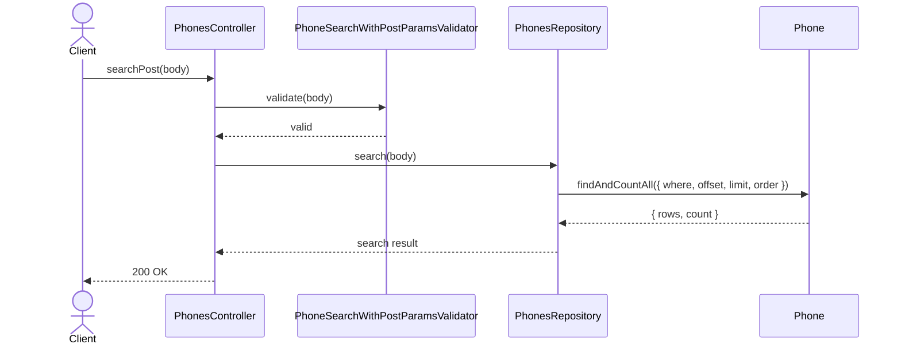
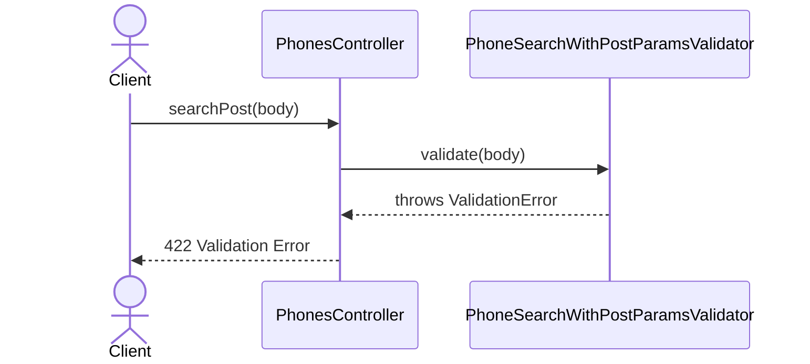

# PhonesController.searchPost

Brief overview: Validates the POST search body, queries `PhonesRepository` directly, and returns `200 OK` when the paginated phone search completes successfully.

## Method

- Route: `POST /v1/phones/search`
- Signature: `PhonesController.searchPost(query: {}, body: PhoneSearchParamsInterface)`

## Success

## 422 Validation Error

