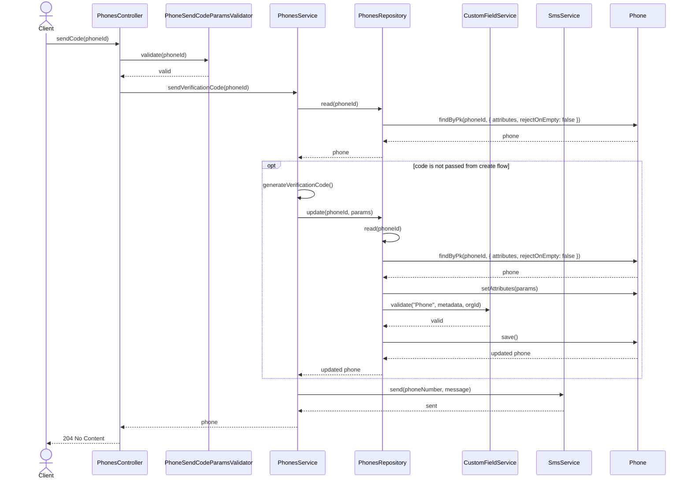
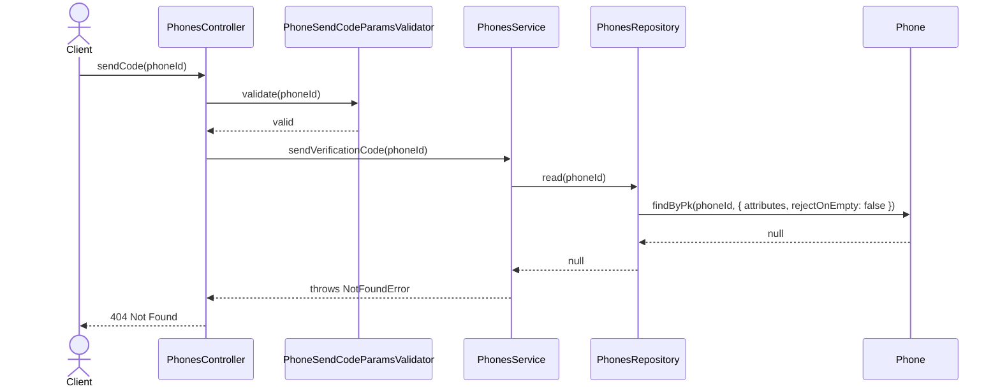
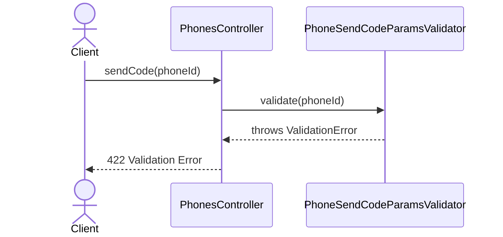

# PhonesController.sendCode

Brief overview: Validates the path parameter, delegates to `PhonesService` to read the phone, optionally generates and stores a new verification code, sends the SMS through `SmsService`, and finishes with `204 No Content`.

## Method

- Route: `POST /v1/phones/:phoneId/send-code`
- Signature: `PhonesController.sendCode(phoneId: number)`

## Success

## 404 Not Found

## 422 Validation Error

