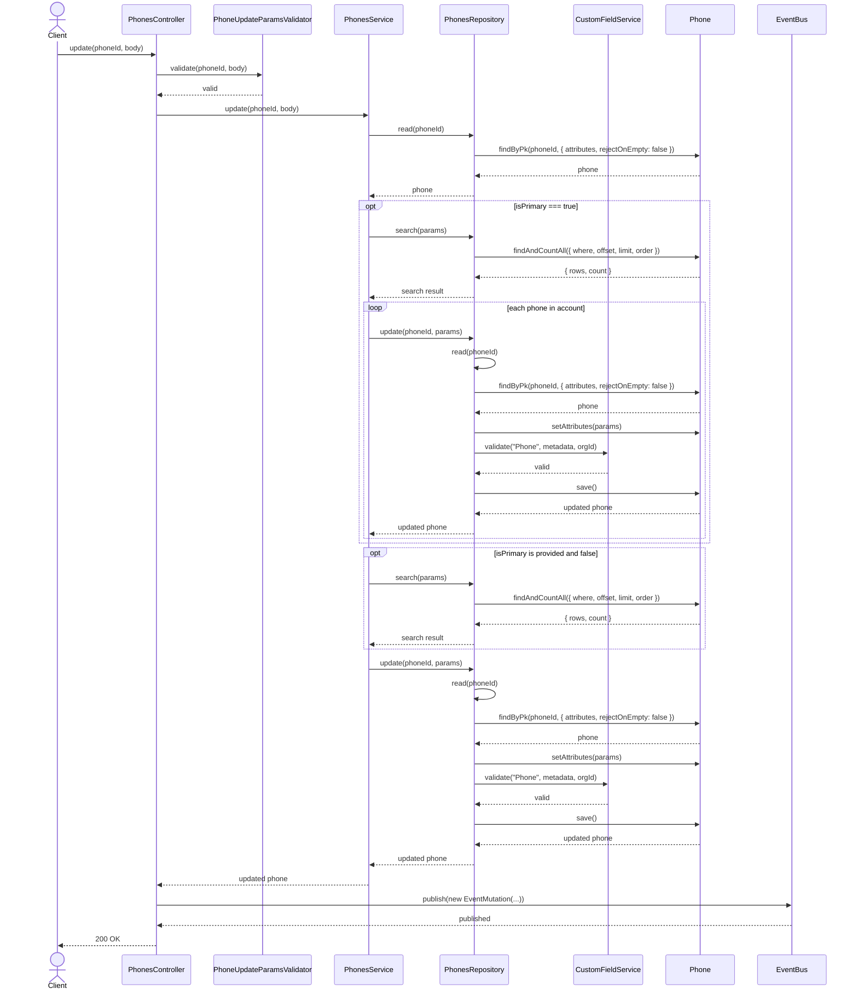
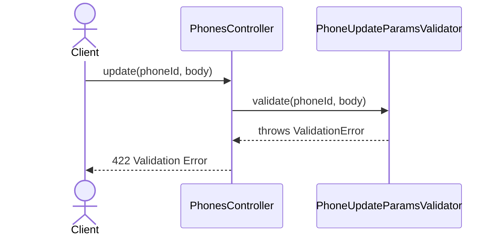
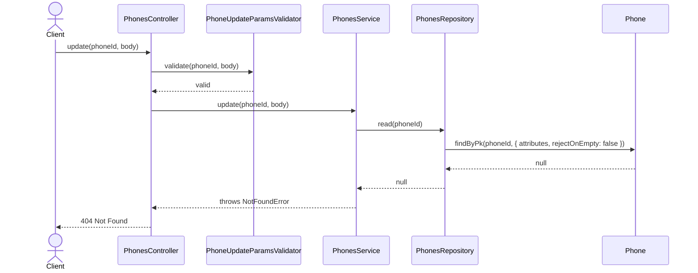
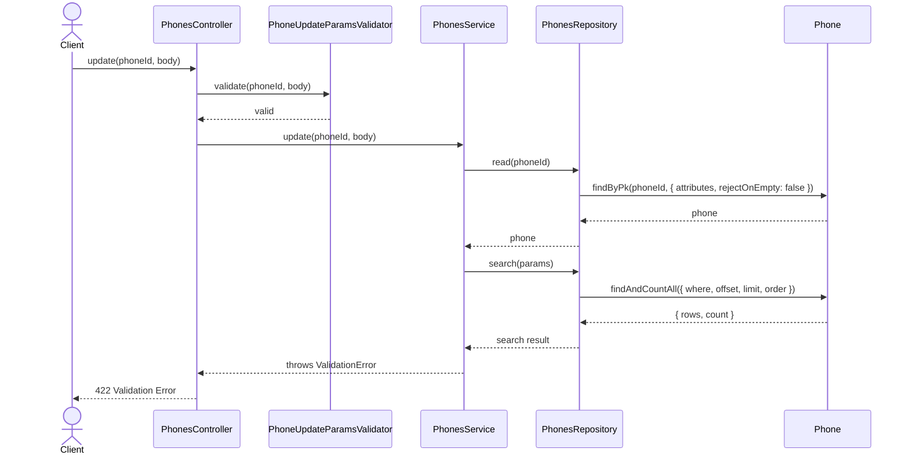
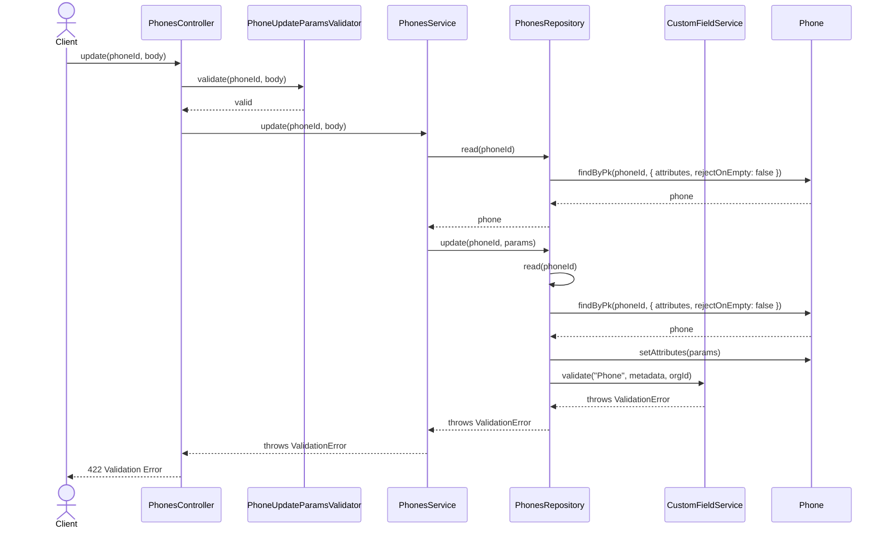

# PhonesController.update

Brief overview: Validates the update request, delegates to `PhonesService`, checks that the target phone exists, optionally reassigns primary-phone state, updates through `PhonesRepository` with custom field validation, publishes an event, and returns `200 OK`.

## Method

- Route: `PUT /v1/phones/:phoneId`
- Signature: `PhonesController.update(phoneId: number, query: {}, body: PhoneUpdateBodyInterface)`

## Success

## 422 Validation Error

## 404 Not Found

## 422 One Primary Phone Validation Failure

## 422 Custom Field Validation Failure

