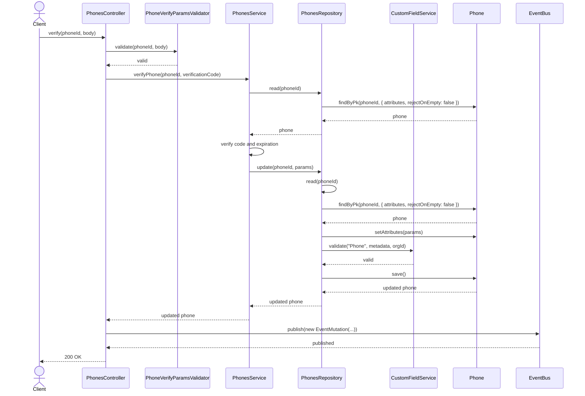
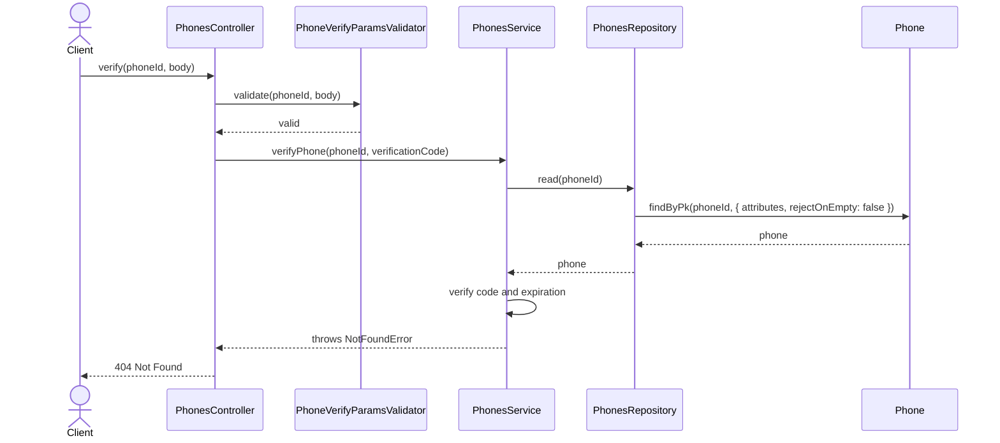
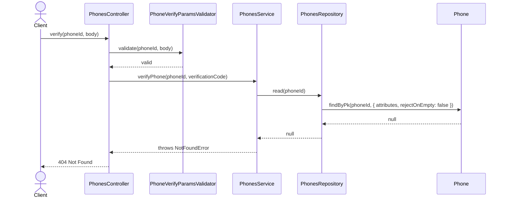
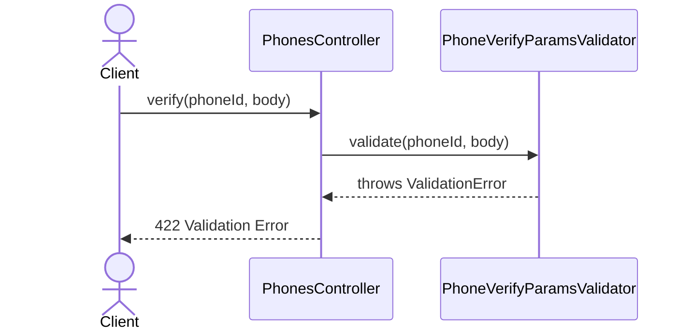

# PhonesController.verify

Brief overview: Validates the verification request, delegates to `PhonesService.verifyPhone`, reads the phone, checks the verification code and expiration in the service, updates the record through `PhonesRepository`, publishes an event, and returns `200 OK`.

## Method

- Route: `POST /v1/phones/:phoneId/verify`
- Signature: `PhonesController.verify(phoneId: number, query: {}, body: PhoneVerifyBodyInterface)`

## Success

## 404 Invalid Or Expired Verification Code

## 404 Not Found

## 422 Validation Error

