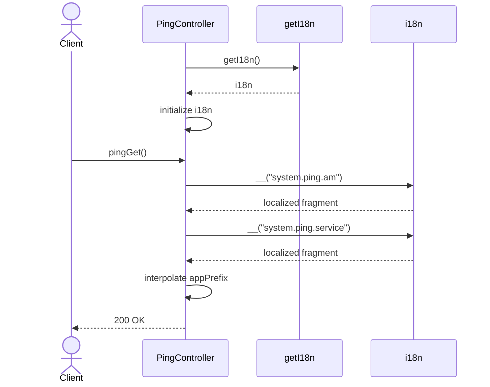

# PingController.pingGet

Brief overview: публичный `GET /v1/ping/alive` доступен без security middleware благодаря явному `@NoSecurity()`. Метод `pingGet()` использует `i18n`, инициализированный через `getI18n()` в конструкторе, собирает локализованное сообщение с `this.appPrefix` и возвращает `200 OK`.

## Method

`GET /v1/ping/alive -> pingGet()`

## Success

