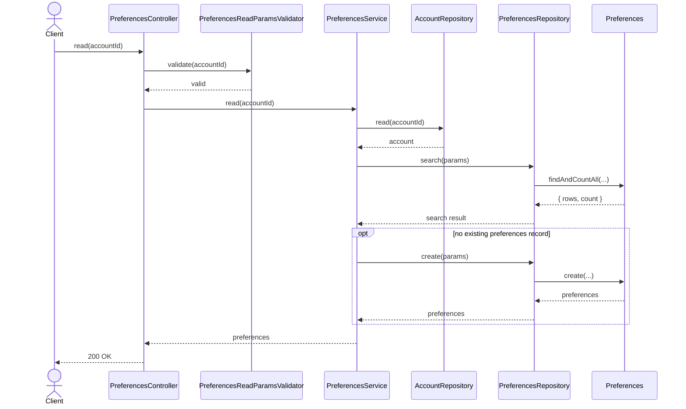
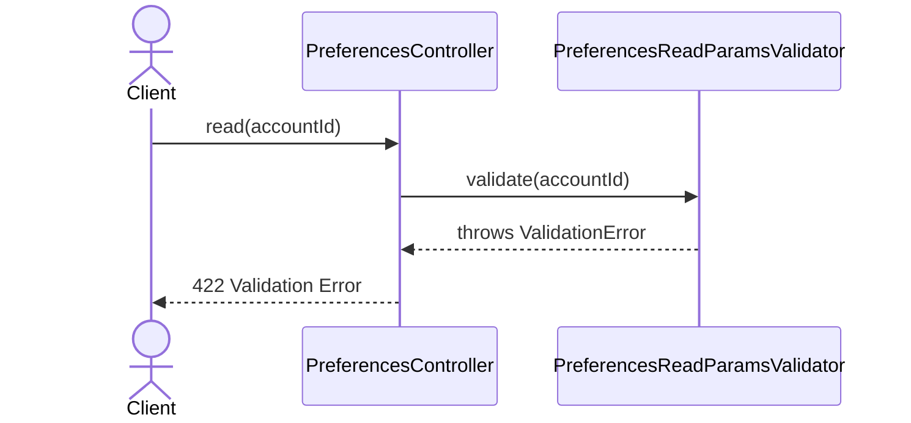
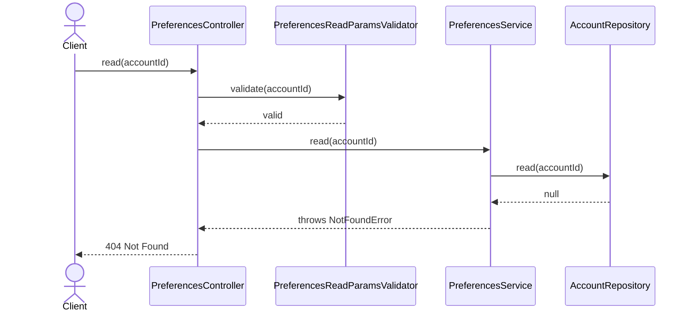

# PreferencesController.read

Brief overview: Validates the path parameter, verifies that the account exists through `AccountRepository`, searches preferences through `PreferencesRepository`, creates a default preferences record on first read when none exists yet, and returns `200 OK` with public attributes `id`, `orgId`, `createdAt`, `updatedAt`, `arn`, `preferences`, and `metadata`.

## Method

- Route: `GET /v1/preferences/:accountId`
- Signature: `PreferencesController.read(accountId)`

## Success

## 422 Validation Error

## 404 Not Found Account Not Found

