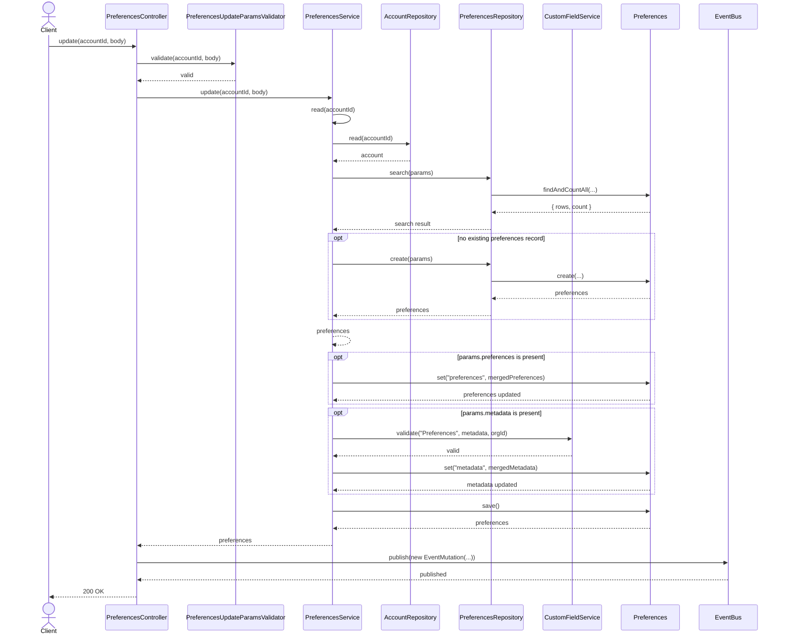
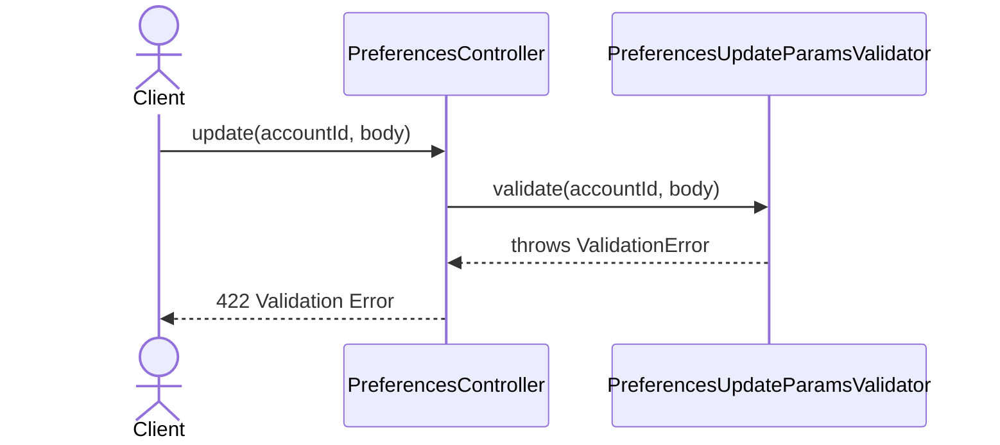
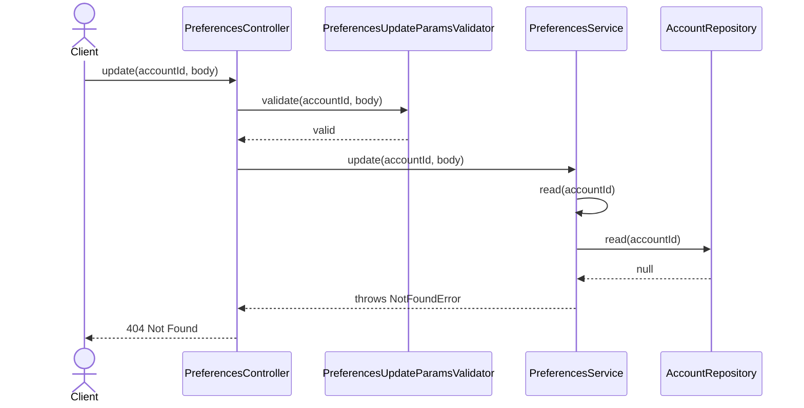
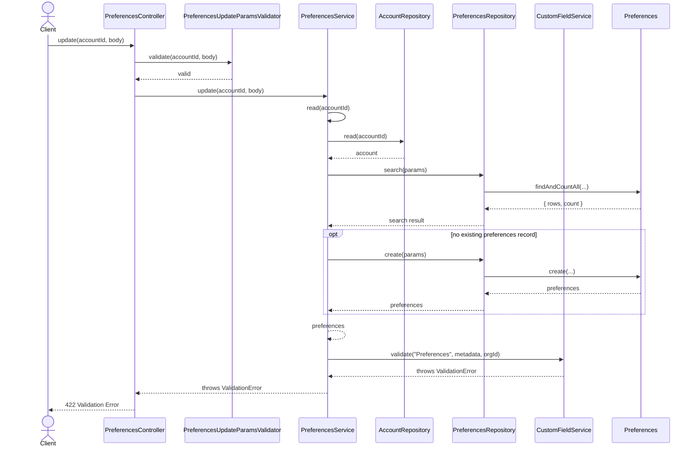

# PreferencesController.update

Brief overview: Validates the request, reuses `PreferencesService.read(accountId)` to load or create the preferences record, optionally merges nested `preferences`, optionally validates and merges `metadata`, saves the model, publishes an event, and returns `200 OK` with public attributes `id`, `orgId`, `createdAt`, `updatedAt`, `arn`, `preferences`, and `metadata`.

## Method

- Route: `POST /v1/preferences/:accountId`
- Signature: `PreferencesController.update(accountId, body)`

## Success

## 422 Validation Error

## 404 Not Found Account Not Found

## 422 Custom Field Validation Error

