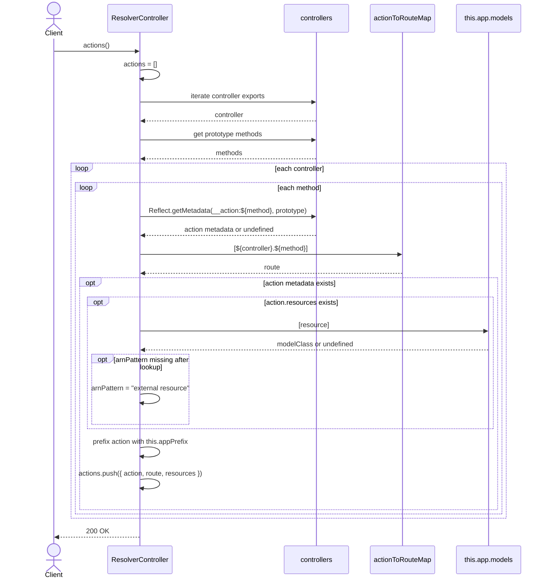

# ResolverController.actions

Brief overview: the method iterates over imported `controllers`, discovers prototype methods, reads action metadata through `Reflect.getMetadata(...)`, looks up the route in `actionToRouteMap`, enriches resources with `arnPattern` from `this.app.models[resource]` when available, and returns the final action list prefixed with `this.appPrefix`.

## Method

`GET /v1/resolver/actions -> actions()`

## Success

