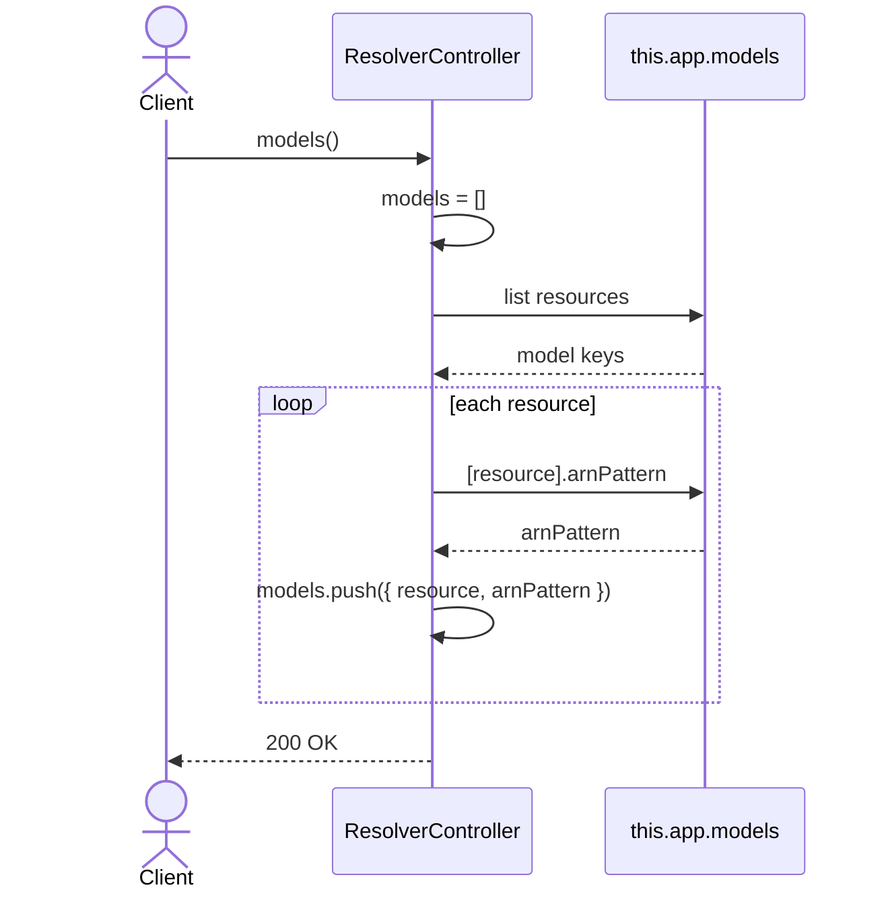

# ResolverController.models

Brief overview: the method iterates over `this.app.models`, collects `resource` and `arnPattern` for each model, and returns the complete model list.

## Method

`GET /v1/resolver/models -> models()`

## Success

