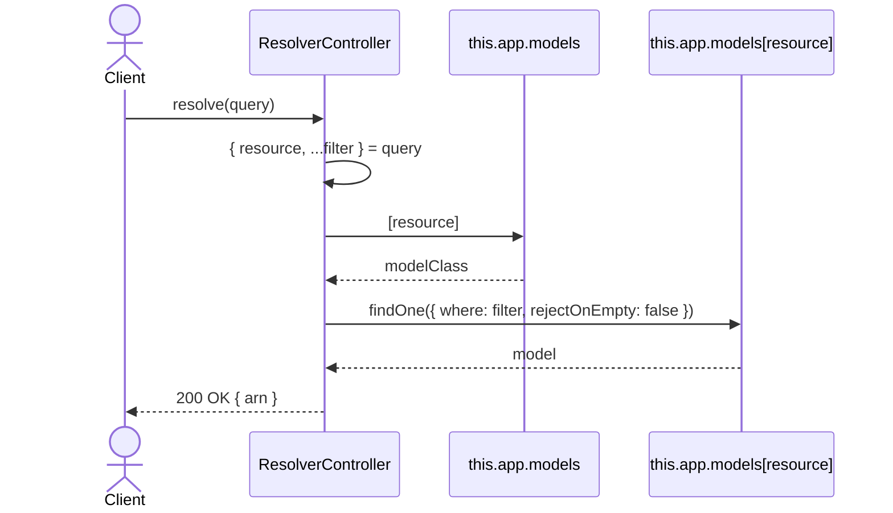
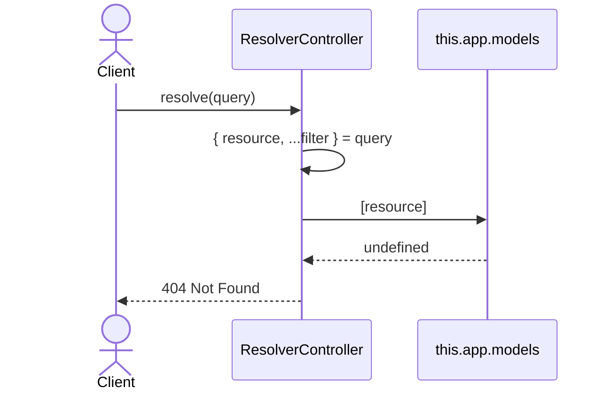
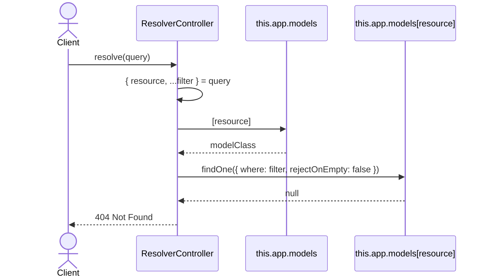

# ResolverController.resolve

Brief overview: the method splits `query` into `resource` and `filter`, looks up the model in `this.app.models[resource]`, executes `findOne({ where: filter, rejectOnEmpty: false })`, and returns the ARN of the resolved record.

## Method

`GET /v1/resolver/resolve -> resolve(query)`

## Success

## 404 Not Found Missing Resource Type

## 404 Not Found Missing Model Instance

