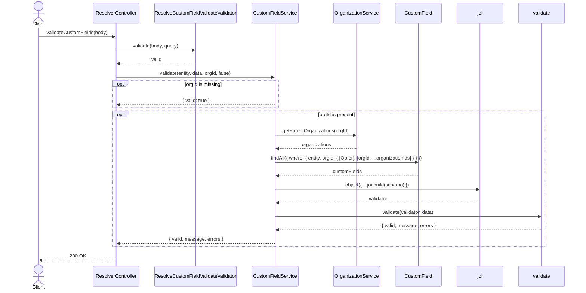
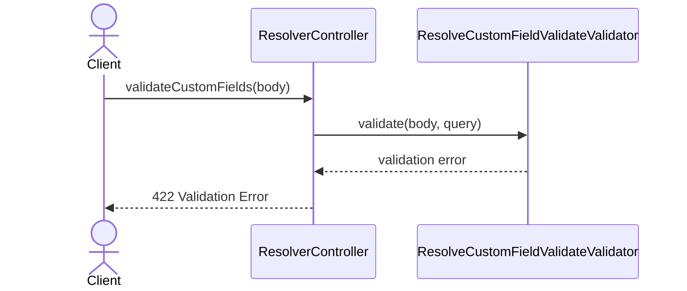

# ResolverController.validateCustomFields

Brief overview: the method first hands the input to `ResolveCustomFieldValidateValidator`, then calls `CustomFieldService.validate(entity, data, orgId, false)`, which optionally loads parent organizations, fetches `CustomField` schemas, builds a Joi validator, and returns the validation result in a `200 OK` response.

## Method

`POST /v1/resolver/validate -> validateCustomFields(body)`

## Success

## 422 Validation Error

