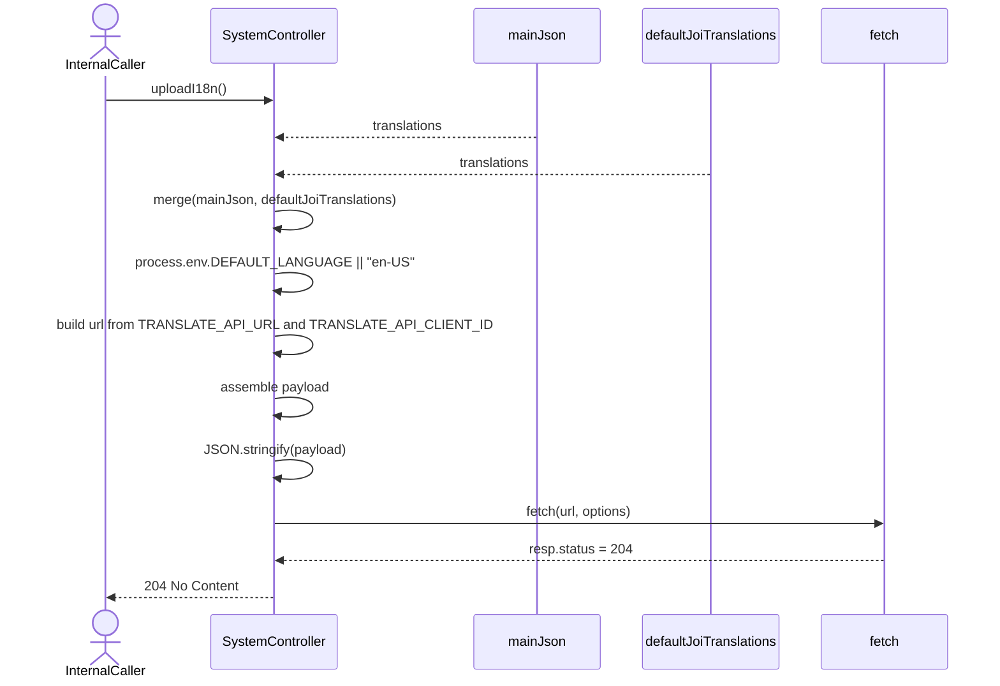
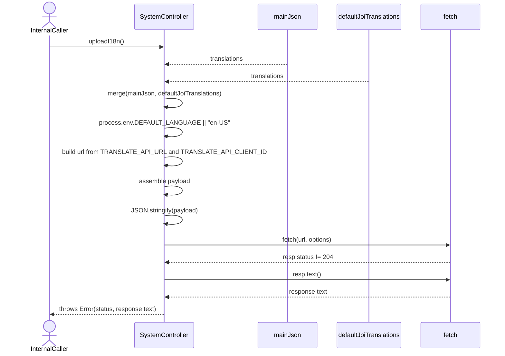

# SystemController.uploadI18n

Brief overview: Internal-only endpoint hidden by `@Hidden()`. It merges `mainJson` and `defaultJoiTranslations`, resolves the locale from `process.env.DEFAULT_LANGUAGE || "en-US"`, builds the translation upload URL from environment variables, serializes the JSON request body, sends a POST request through `fetch`, and only completes successfully when the response status is `204 No Content`.

## Method

- Route: `POST /v1/system/i18n-upload`
- Signature: `SystemController.uploadI18n()`
- Visibility: internal-only via `@Hidden()`

## Success

## Translation Upload Returned Non-204

