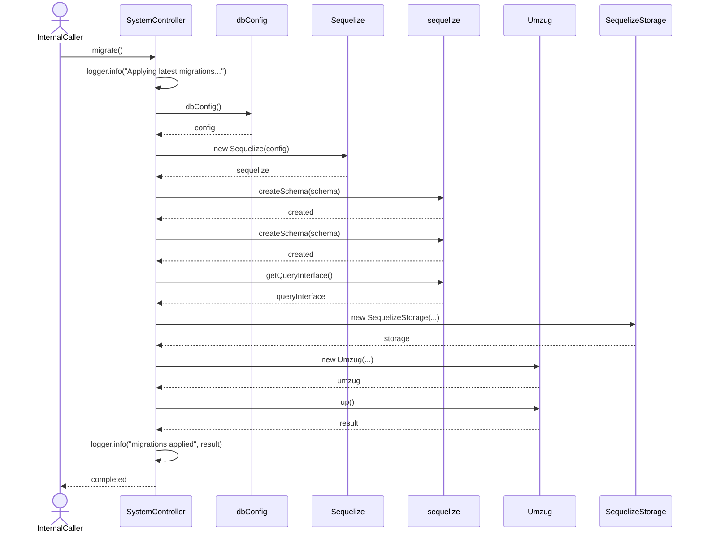
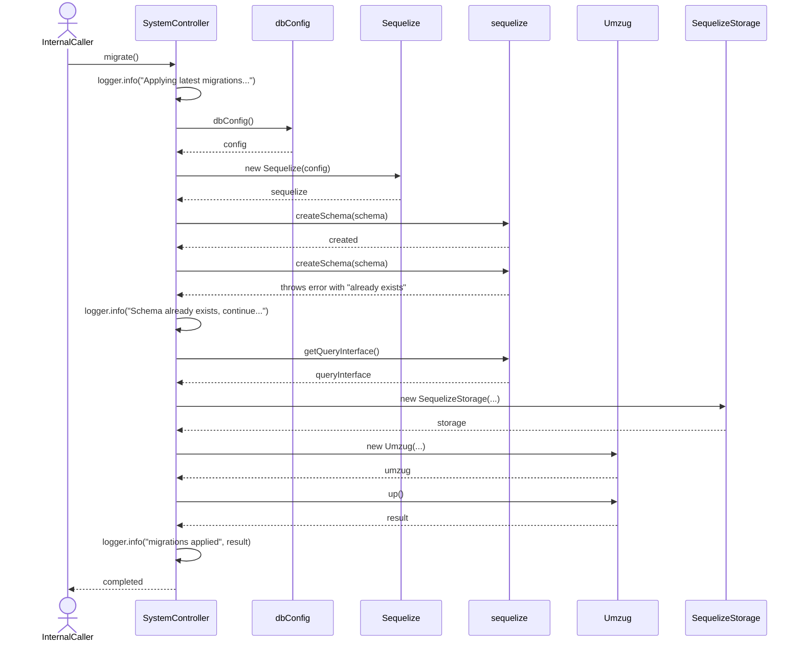
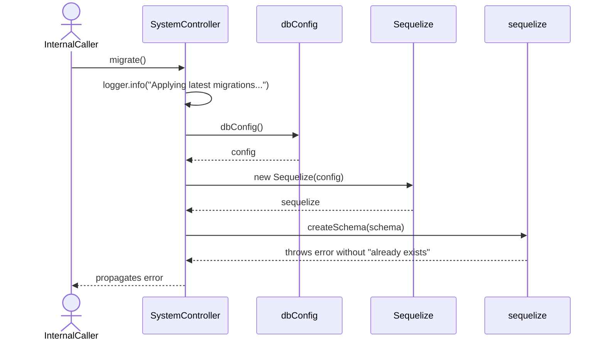
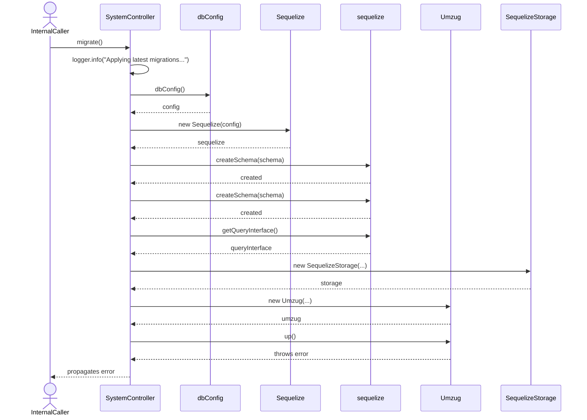

# SystemController.migrate

Brief overview: Internal-only endpoint hidden by `@Hidden()`. It logs migration start, loads database config through `dbConfig()`, creates a `sequelize` instance from `new Sequelize(config)`, attempts schema creation inside one shared `try` block, builds `Umzug` with `sequelize.getQueryInterface()` and `new SequelizeStorage(...)`, executes pending migrations through `up()`, and logs the applied migration count.

## Method

- Route: `POST /v1/system/migrate`
- Signature: `SystemController.migrate()`
- Visibility: internal-only via `@Hidden()`

## Success

## Continue On "already exists"

## Schema Creation Failure

## Migration Failure

