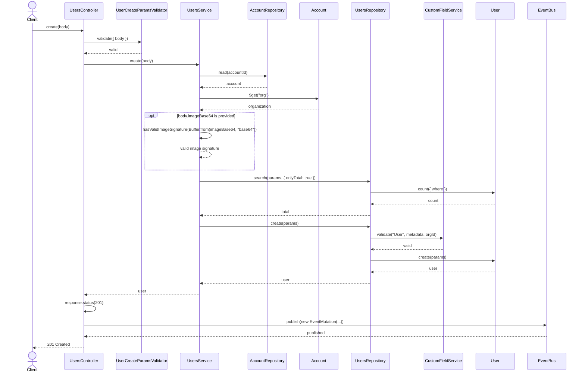
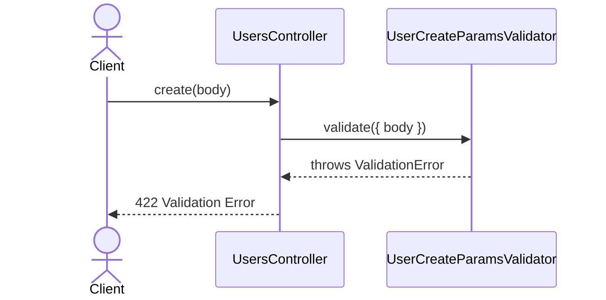
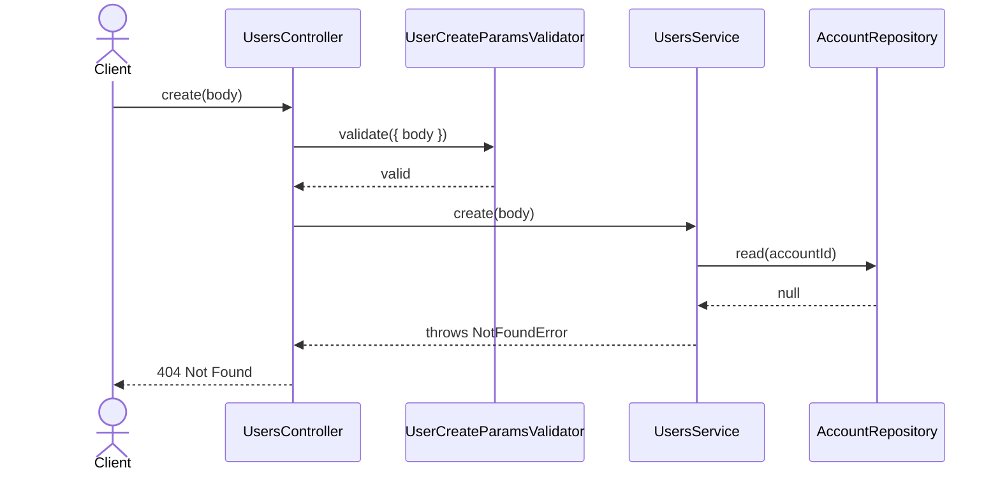
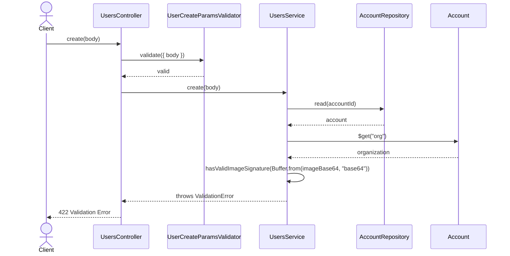
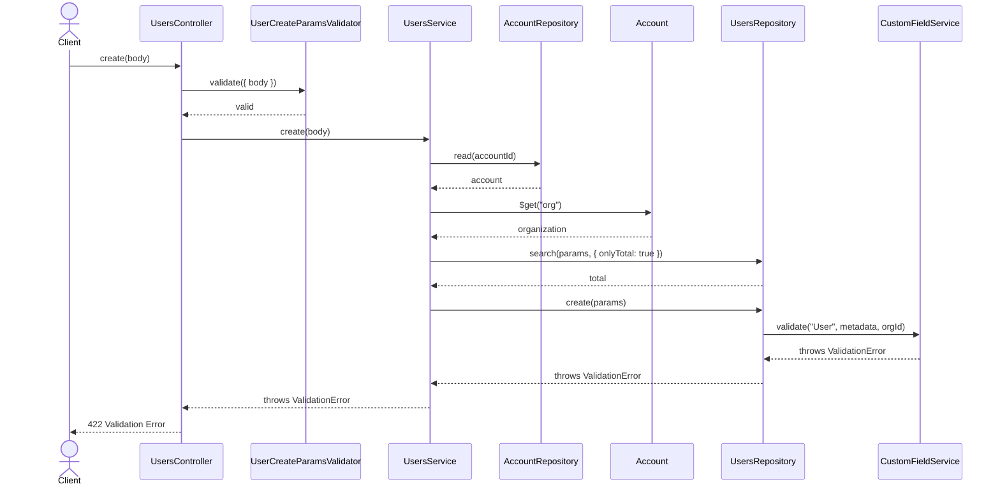

# UsersController.create

Brief overview: Validates the create request, resolves the target account and organization in `UsersService`, optionally validates the image signature, detects whether the new user must be primary, creates the record through `UsersRepository`, validates custom fields inside the repository create path, publishes an event, and returns `201 Created`.

## Method

- Route: `POST /v1/users`
- Signature: `UsersController.create(body)`

## Success

## 422 Validation Error

## 404 Not Found Account Not Found

## 422 Invalid Image Validation Error

## 422 Custom Field Validation Error

