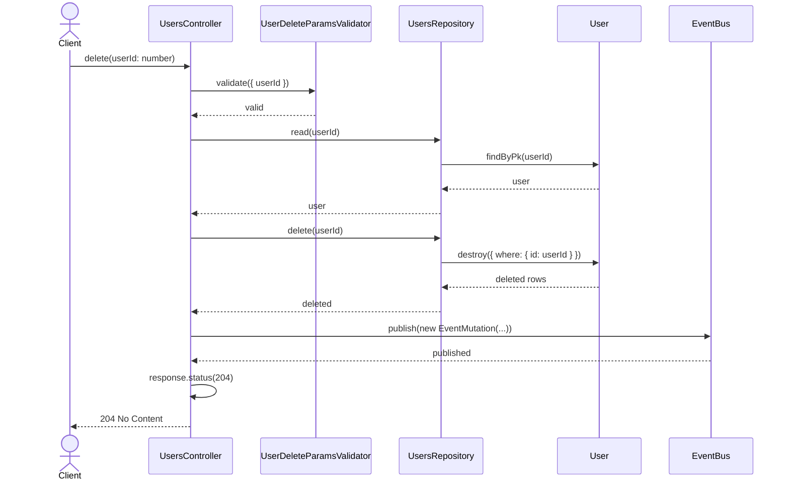
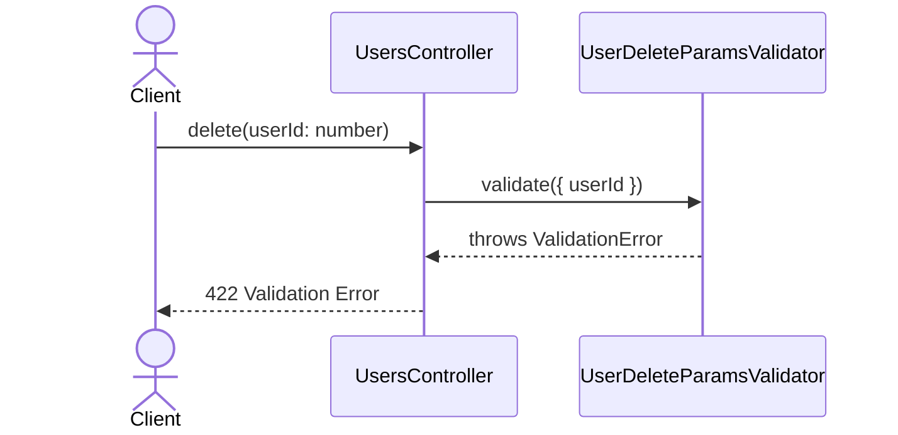
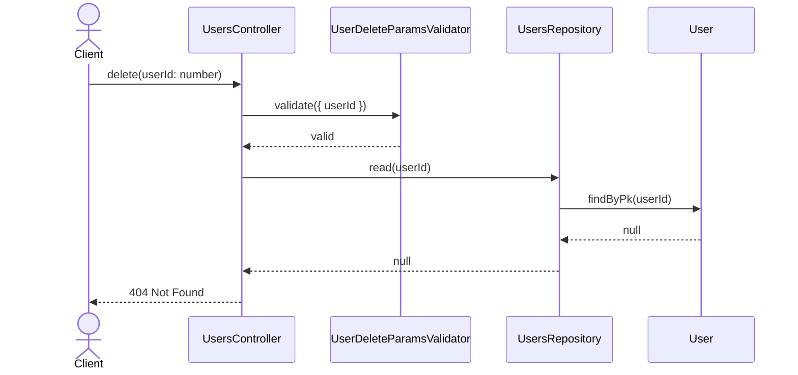

# UsersController.delete

Brief overview: Validates the delete request, reads the user before deletion through `UsersRepository`, deletes the record, publishes an event, sets the response status, and returns no content.

## Method

- Route: `DELETE /v1/users/:userId`
- Signature: `UsersController.delete(userId: number)`

## Success

## 422 Validation Error

## 404 Not Found

