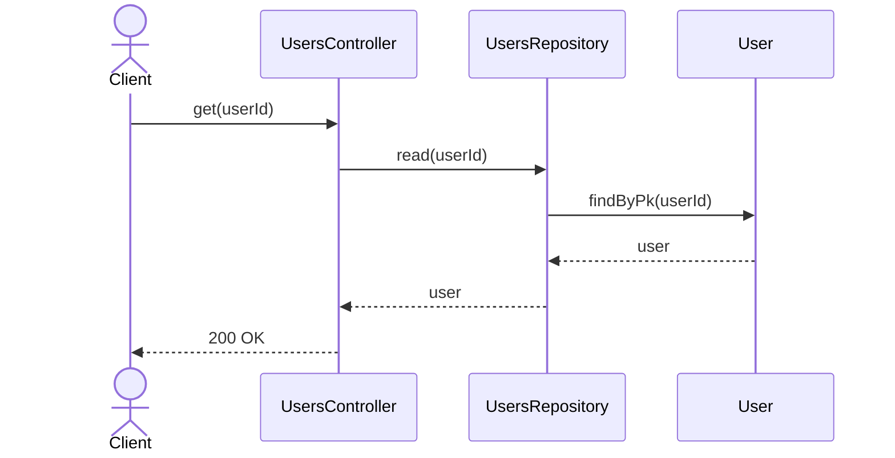
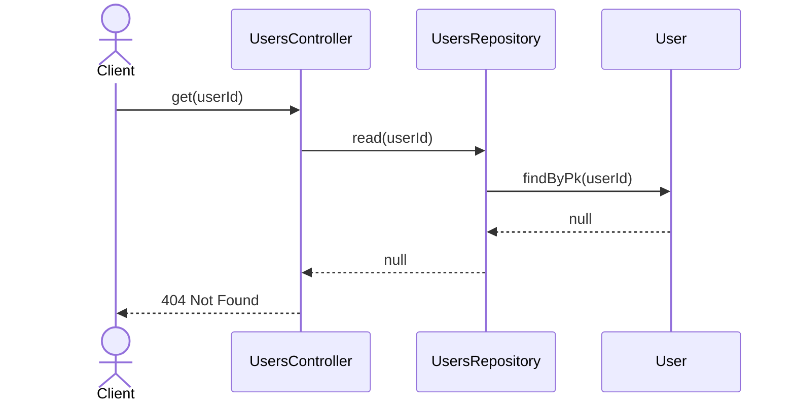

# UsersController.get

Brief overview: Reads one user through `UsersRepository`, returns `404 Not Found` when the record is missing, and otherwise returns `200 OK`.

## Method

- Route: `GET /v1/users/:userId`
- Signature: `UsersController.get(userId)`

## Success

## 404 Not Found

