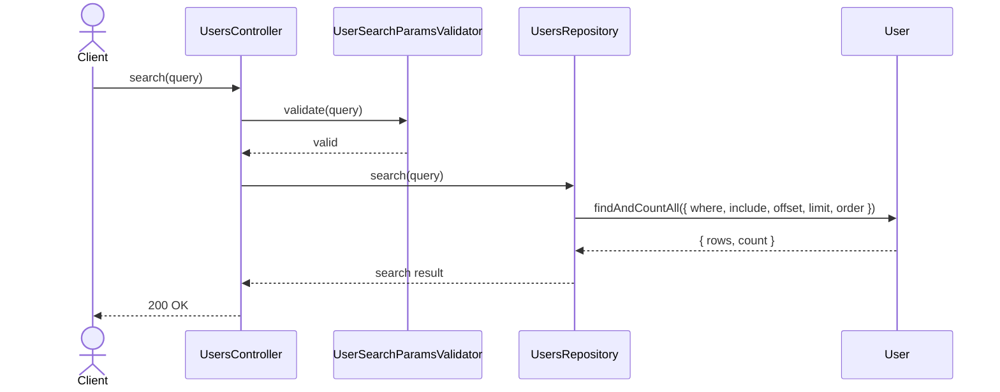
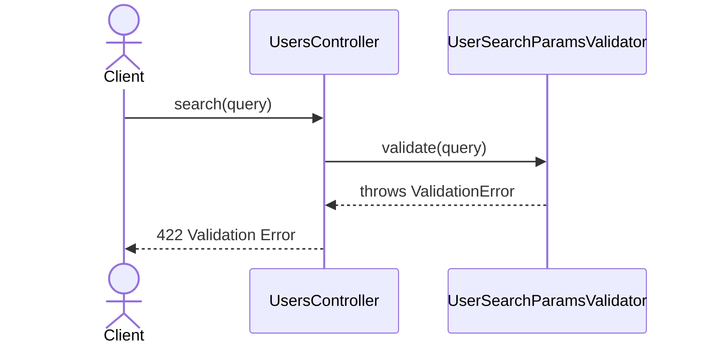

# UsersController.search

Brief overview: Validates the GET search query, delegates the search to `UsersRepository`, and returns `200 OK`.

## Method

- Route: `GET /v1/users`
- Signature: `UsersController.search(query)`

## Success

## 422 Validation Error

