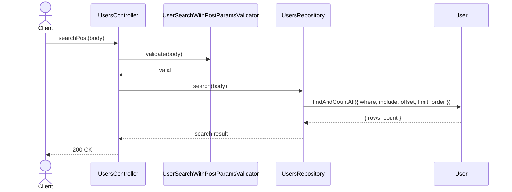
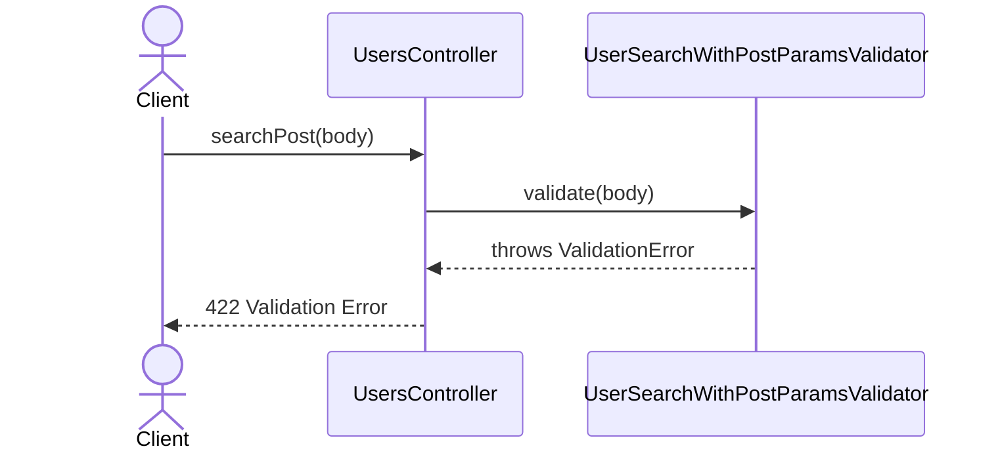

# UsersController.searchPost

Brief overview: Validates the POST search body, delegates the search to `UsersRepository`, and returns `200 OK`.

## Method

- Route: `POST /v1/users/search`
- Signature: `UsersController.searchPost(body)`

## Success

## 422 Validation Error

