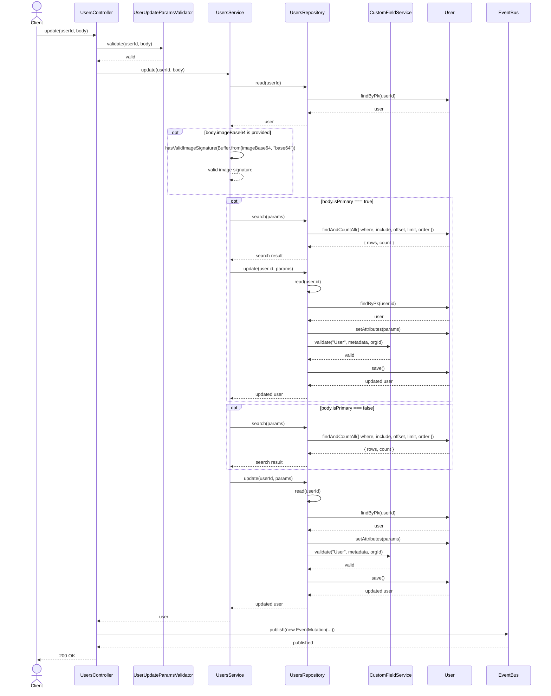
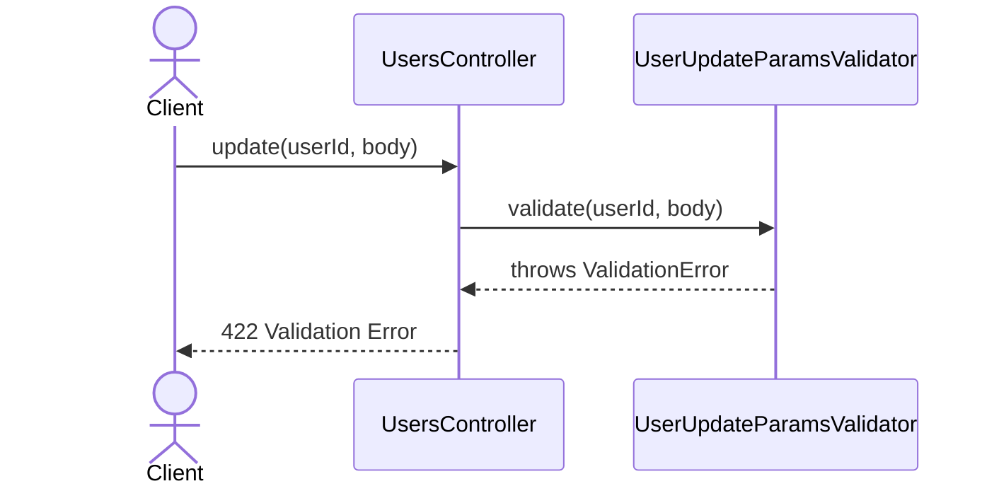
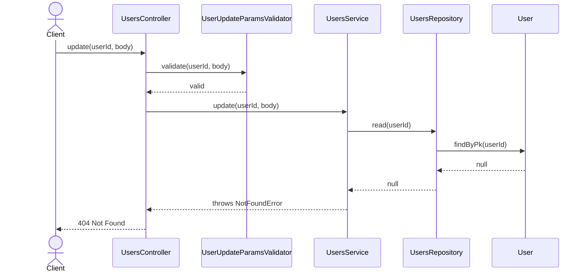
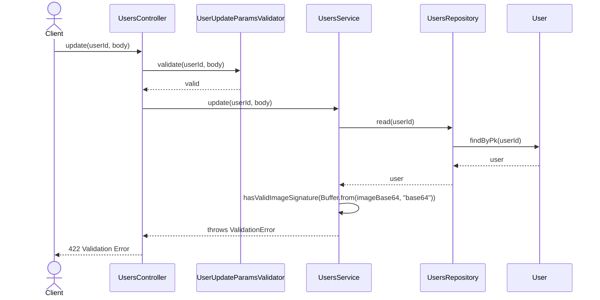
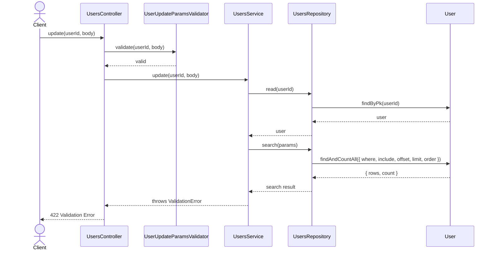
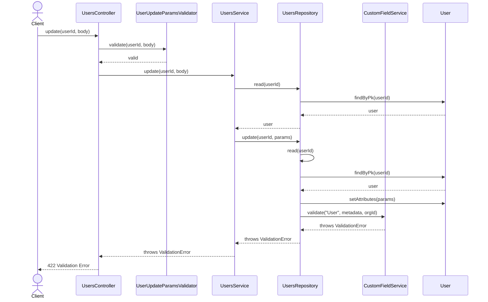

# UsersController.update

Brief overview: Validates the update request, checks the target user in `UsersService`, optionally validates the image signature and primary-user rules, updates the record through `UsersRepository`, validates custom fields inside the repository update path, saves the user, publishes an event, and returns `200 OK`.

## Method

- Route: `PUT /v1/users/:userId`
- Signature: `UsersController.update(userId, body)`

## Success

## 422 Validation Error

## 404 Not Found

## 422 Invalid Image Validation Error

## 422 Primary User Validation Error

## 422 Custom Field Validation Error

